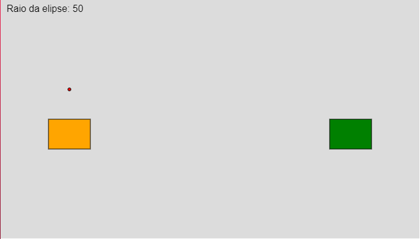

# Jogo de Projéteis

Esse jogo foi feito apenas com JS, em resposta à avaliação da matéria de computação gráfica. O objetivo era fazer um jogo simples onde dois jogadores competem para acertar um ao outro, lançando um projétil em uma arena interativa. 
[Jogar](https://tchez.github.io/GameJS/)

## Funcionalidades

- **Arena Interativa:** A arena de jogo onde os jogadores competem, delimitada para assegurar uma competição justa.
- **Jogadores:** Dois jogadores representados por retângulos de cores distintas (laranja para o Player 1 e verde para o Player 2).
- **Projétil:** Um projétil controlável que os jogadores lançam um contra o outro.

## Controles

Os jogadores controlam o centro da elipse que determina a trajetória do projétil. Abaixo estão os controles disponíveis para ajustar a posição e o raio da elipse:

- `+`: Aumenta o raio da elipse da trajetória.
- `-`: Diminui o raio da elipse da trajetória.
- `⬆`: Move o centro da elipse para cima.
- `⬇`: Move o centro da elipse para baixo.
- `➡`: Move o centro da elipse para a direita.
- `⬅`: Move o centro da elipse para a esquerda.
- `F`: Dispara o projétil seguindo a trajetória definida.

> **Nota:** O sketch não apresenta visualmente a trajetória, apenas o centro da elipse.

## Como Jogar

1. **Início do Jogo:** O jogo começa com o Player 1 posicionando o centro da elipse para determinar a trajetória do projétil.
2. **Posicionamento:** Utilize os controles descritos acima para posicionar corretamente o centro da elipse e definir a trajetória ideal para atingir o adversário.
3. **Lançamento do Projétil:** Após definir a trajetória, pressione a tecla `F` para lançar o projétil.
4. **Turno do Adversário:** Se o projétil não atingir o Player 2, é a vez do Player 2 definir a trajetória e lançar o projétil, e assim sucessivamente.
5. **Vencendo o Jogo:** O jogo termina quando um dos jogadores é atingido pelo projétil.

## Tecnologias Usadas
> Para essa atividade estavamos limitados à usar a p5js

| Tecnologia | Link |
|------------|------|
| p5.js      | [Saiba mais](https://p5js.org/) |
| JavaScript | [Saiba mais](https://www.javascript.com/) |
| HTML5      | [Saiba mais](https://developer.mozilla.org/pt-BR/docs/Web/HTML) |
| CSS3       | [Saiba mais](https://developer.mozilla.org/pt-BR/docs/Web/CSS) |
| GitHub Pages | [Saiba mais](https://pages.github.com/) |
